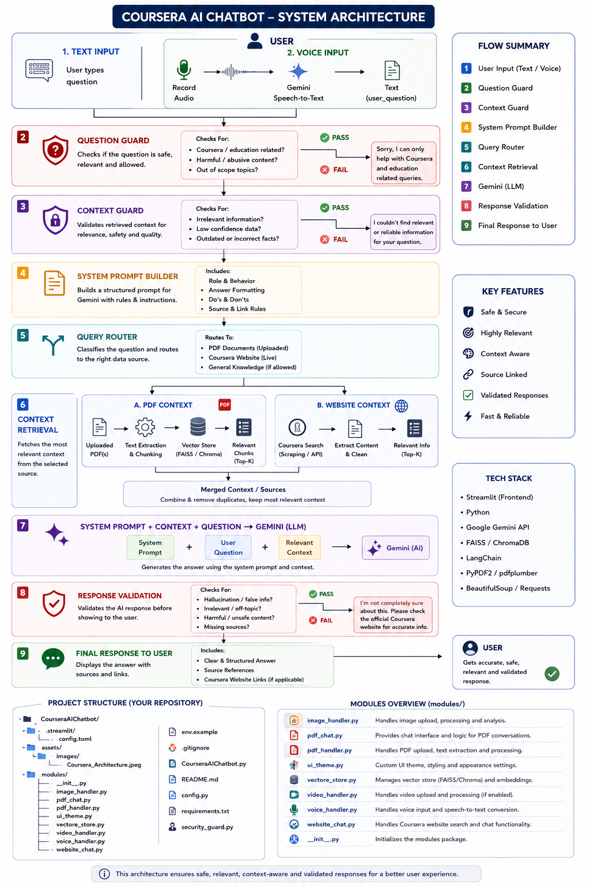

a# 🤖 Coursera AI Chatbot

A Streamlit-based AI chatbot that understands PDF, Image, Video, and Voice input to answer Coursera-related questions — backed by a 4-layer security guard (protection against prompt injection, off-topic questions, and unsafe answers).

## ✨ Features

- 📄 **PDF understanding** — Supports both text-layer PDFs and scanned/image-based PDFs
- 🖼️ **Image understanding** — OCR + charts/tables/UI explanation
- 🎥 **Video understanding** — full transcript, timestamps, scene description, OCR
- 🎙️ **Voice input** — Speech-to-text support for English, Hindi, and Hinglish
- 🌐 **Live website search** — Real-time answers from Coursera.org using Tavily
- 🛡️ **4-layer Security Guard** — Question Guard → Context Guard → System Prompt → Response Validator

## 📁 Project Structure

```
coursera-ai-chatbot/
├── CourseraAIChatbot.py     # Main Streamlit app (UI + orchestration)
├── config.py                # Gemini + Tavily API key setup
├── security_guard.py        # 4-layer security guard logic
├── modules/
│   ├── pdf_handler.py       # PDF text extraction
│   ├── image_handler.py     # Image OCR + analysis
│   ├── video_handler.py     # Video analysis
│   ├── voice_handler.py     # Voice-to-text
│   ├── vector_store.py      # Chunking + FAISS vector store
│   ├── pdf_chat.py          # Chat over uploaded content
│   └── website_chat.py      # Chat over live Coursera website search
├── requirements.txt
├── .env.example
└── .gitignore
```

## ⚙️ Setup

1. Clone the repo:
   ```bash
   git clone https://github.com/<your-username>/coursera-ai-chatbot.git
   cd coursera-ai-chatbot
   ```

2. Create a virtual environment and install dependencies:
   ```bash
   python -m venv venv
   source venv/bin/activate      # Windows: venv\Scripts\activate
   pip install -r requirements.txt
   ```

3. Set up your API keys:
   ```bash
   cp .env.example .env
   # .env file kholkar apni GOOGLE_API_KEY aur TAVILY_API_KEY daal do
   ```

4. Run the app:
   ```bash
   python -m streamlit run CourseraAIChatbot.py
   ```

## 🔑 Getting API Keys

- **Google Gemini API Key** — https://aistudio.google.com/app/apikey
- **Tavily API Key** — https://tavily.com

## 🛡️ Security Layers (`security_guard.py`)

| Layer | Purpose |
|-------|---------|
| Question Guard | Checks whether the user's question is related to Coursera or not |
| Context Guard | Verifies whether the retrieved content comes from an official Coursera source |
| Master System Prompt | Constrains the model's role, behavior, and response guidelines |
| Response Validator | Verifies that the final answer is safe, relevant, and appropriate |

## 📜 License

MIT

# Coursera AI Chatbot

## 🏗️ System Architecture


